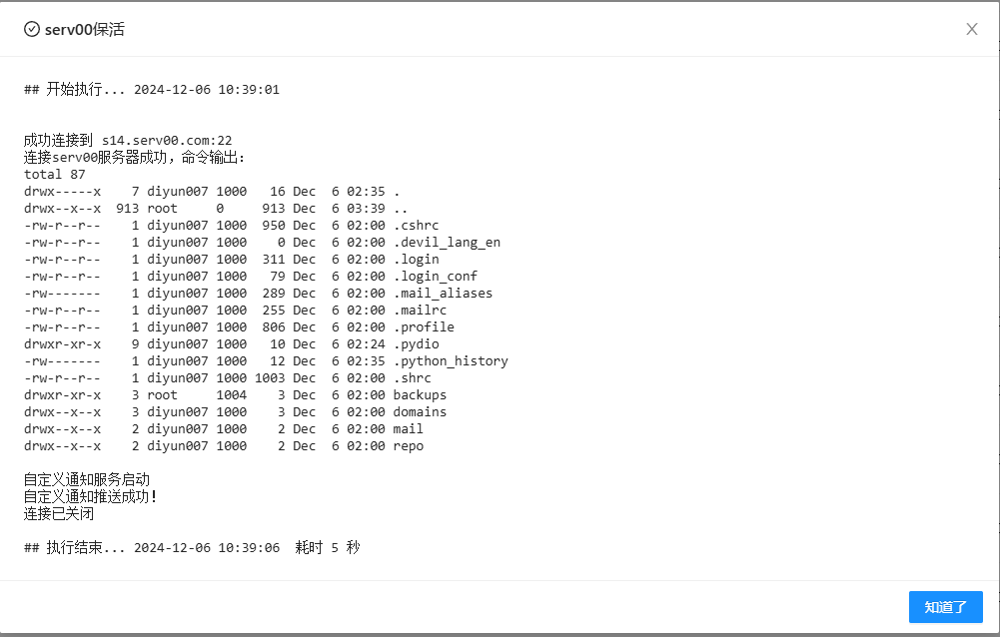

# 青龙面板可用的Serv00服务器保活脚本
## 食用方法
### 设置环境变量  
SSH_HOST：服务器IP或域名  
SSH_PORT：SSH端口号（可不设置，默认22）  
SSH_USER：SSH用户名  
SSH_PASS：SSH密码  
SSH_COMMAND：要执行的命令（可不设置，默认ls -la）

### 添加依赖
青龙面板中添加python依赖：paramiko

### 添加脚本
将脚本放到青龙面板脚本目录下，然后在任务中添加任务即可，建议每个月运行一次  

### 脚本运行结果示例

脚本默认使用了青龙面板自带的通知功能，可以自行配置通知
